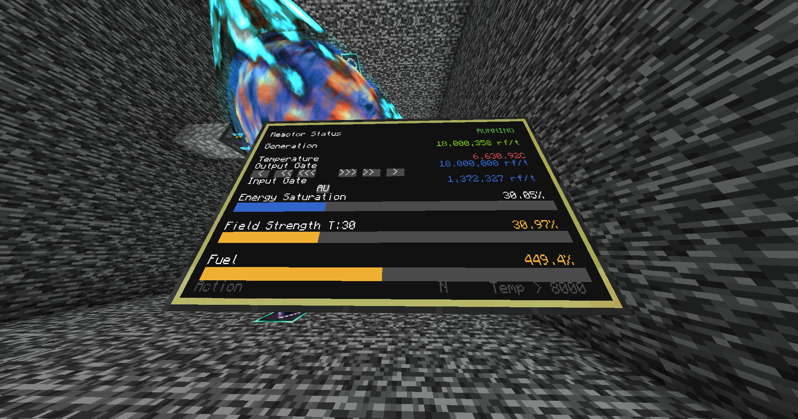
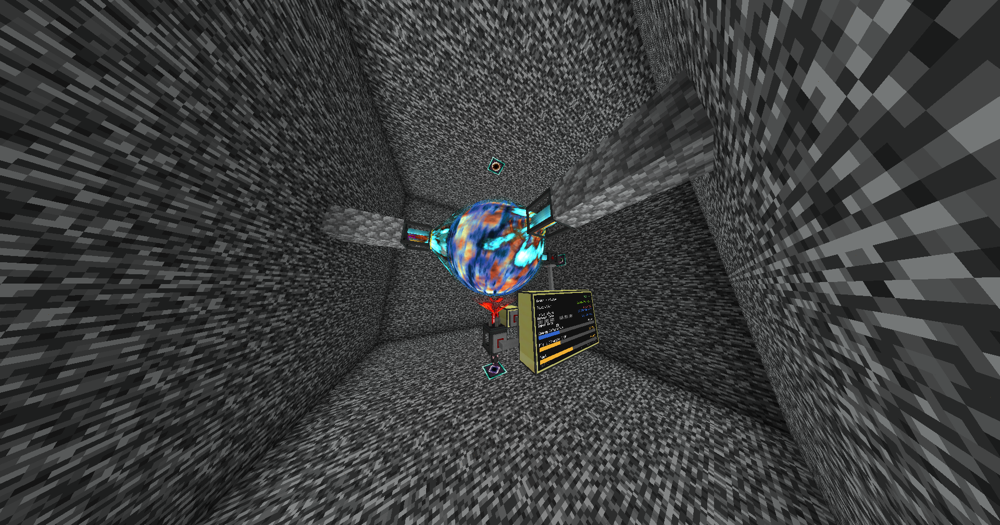

# Drmon
Monitor and failsafe automation for your Draconic reactor (Draconic Evolution)




### About
This is a Computercraft (CC:Tweaked) LUA script that monitors everything about a draconic reactor, with a couple features to help keep it from exploding.
**Note:** This is for Minecraft 1.20.1, __specifically tested for ATM9__. Any changes in versions before or after the 1.1.1 ATM9 launch might need changes in the code.

### Features
* Uses a 3x3 advanced computer touchscreen monitor to interact with your reactor
* Automated regulation of the input gate for the targeted field strength of 30%
  * adjustable
* Immediate shutdown and charge upon your field strength going below a customisable amount
  * Reactor will activate upon a successful charge
* Immediate shutdown when your temperature goes above 8000C
  * adjustable
  * Reactor will activate upon temperature cooling down to 3000C
    * adjustable
* Easily tweak your output flux gate via touchscreen buttons
  * +/-100k, 10k, and 1k increments

### Requirements
* One fully setup draconic reactor with fuel
  * (Optimal 50/50 fuel, 4x Awakened Draconium Block, 4x Large Chaos Fragment)
* 1 advanced computer
* 9 or more advanced monitors (depending on your preferences)
* 3-4 wired modems, wireless will not work
  * (4 are needed if you want to place the monitor somewhere further away)
* A bunch of network cable

### Setup
* Place your advanced computer so that it's back is against a Reactor Stabilizer.
* Place a wired modem on your computer.
* Place a wired modem on the flux gate where the power will be going OUT of the reactor.
* Place a wired modem on the flux gate where the power will be going IN to the reactor.
* Place a wired modem on your monitor (Optional, otherwise MUST be adjacent to the computer).
* Run network cables from your wired modems to the modem connected to your computer and make sure you turn them on.
* When you turn on the modem, the game will put a message into the chat saying the name of the device you connected. Make sure to note these down as you will need them.
* Install the script using these commands in your advanced computer: 

```
> pastebin get qEHQE71B install
> install
```
* Modify the `startup.lua` file that was created upon running the installation script to fit your setup: set the ```outputFluxGate``` (line 3) to the name that the game put in the chat when you started the modem on the flux gate that power will be going OUT from. Do the same on line 4 for `inputFluxGate`.
```
> startup
```
* You should see stats in your terminal, and on your monitor

### Upgrading to the latest version (if you already had this setup)
* right click your computer
* hold ctrl+t until you get a `>`

```
> install
> startup
```

# Note
~~If you want to fiddle around with screen sizes, you can add a text scaling line under line 32 that searches for your monitor. Scaling 1.5 looks fine on a 5x5 monitor for example.~~
Screen size adjusts automatically.
I recommend a 3x5 monitor setup.
